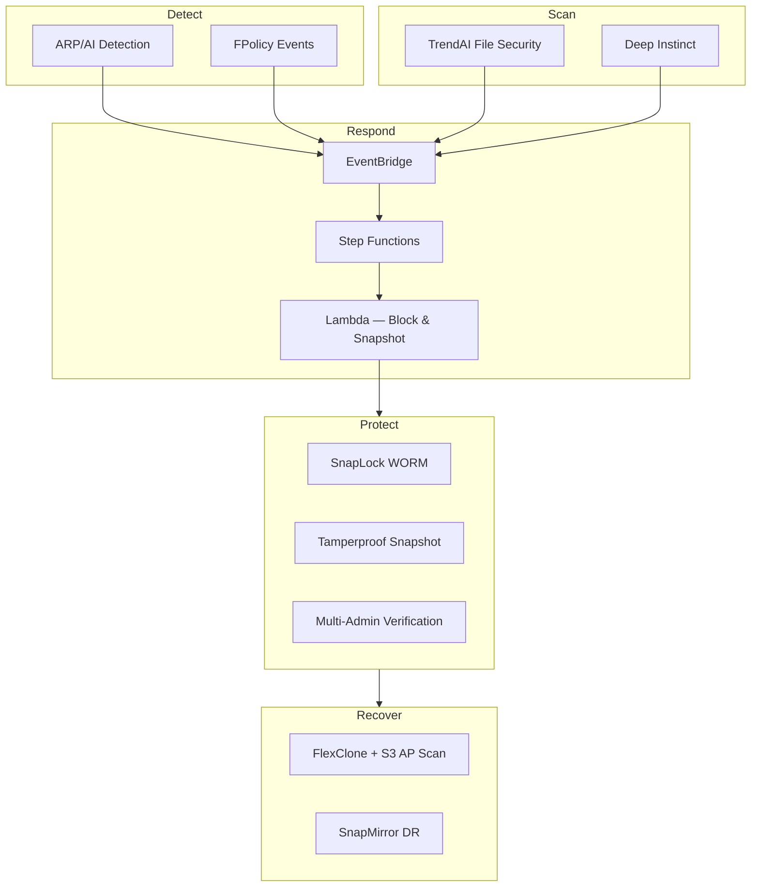

# FSx for ONTAP Cyber Resilience Patterns

[](https://github.com/Yoshiki0705/fsxn-cyber-resilience-patterns/actions/workflows/ci.yml)
[](https://scorecard.dev/viewer/?uri=github.com/Yoshiki0705/fsxn-cyber-resilience-patterns)
[](LICENSE)

🌐 **Language**: English | [日本語](docs/ja/README.md)

> Ransomware encrypting files on your NAS? This project detects it within seconds and automatically blocks the attacker at the storage layer — before a human can even open their laptop. Everything deploys as CloudFormation on AWS.

Multi-layered cyber resilience patterns for Amazon FSx for NetApp ONTAP — combining storage-native security, AI-powered threat prevention, and event-driven automated response.

## はじめる / Get Started

| やりたいこと | ガイド | 所要時間 |
|-------------|--------|---------|
| アーキテクチャを理解する | [Architecture Overview](docs/architecture/overview.md) | 10 min |
| 新規環境にデプロイする | [Quickstart Deployment](docs/quickstart-deployment.md) | 45 min |
| 既存 FSx for ONTAP に追加する | [Existing Environment Guide](docs/deployment-guide-existing-fsxn.md) | 30 min |
| ARP アラートに対応する | [ARP Alert Triage Runbook](docs/runbooks/arp-alert-triage.md) | 5 min |
| ランサムウェア復旧を実行する | [Recovery Runbook](docs/runbooks/ransomware-recovery.md) | 15 min |
| セキュリティ層を比較する | [Security Layer Comparison](docs/comparison-security-layers.md) | 10 min |

## Architecture



| Layer | Technology | Role |
|-------|-----------|------|
| Storage-native | ARP, FPolicy, SnapLock, Tamperproof Snapshot, MAV | Detection & immutability |
| File scanning | TrendAI Vision One File Security | Real-time malware detection (Vscan/ICAP) |
| AI prevention | Deep Instinct for NetApp ONTAP | Zero-day threat prevention |
| Event-driven | FPolicy → EventBridge → Step Functions | Automated quarantine & response |
| Data protection | Snapshot, SnapMirror, FlexClone | Recovery & evidence preservation |

<details>
<summary>📂 全パターン一覧 / All Patterns</summary>

| Solution | Directory | Description |
|----------|-----------|-------------|
| ONTAP Native Security | `solutions/ontap-native/` | ARP, FPolicy, SnapLock, MAV configurations |
| TrendAI File Security | `solutions/trendai-file-security/` | Vision One Vscan/ICAP + S3 AP integration |
| Deep Instinct | `solutions/deep-instinct/` | AI-powered file scanning patterns |
| Event-Driven Response | `solutions/event-driven-response/` | FPolicy → EventBridge → Step Functions |
| Observability | `solutions/observability/` | Security metrics & CloudWatch dashboard |
| SIEM Integration | `solutions/siem/` | Security Hub, Splunk/QRadar/CEF connectors |
| Compliance Evidence | `solutions/compliance/` | SOC2/ISO27001 evidence collection |
| Shared Library | `solutions/shared/` | ONTAP REST API client library |

**Templates** (`templates/`): `main.yaml` (nested stack orchestrator), `network.yaml`, `storage.yaml`, `event-driven.yaml`, `scanning.yaml`, `scanning-ha.yaml`, `observability.yaml`, `cost-scheduler.yaml`, `dr-replication.yaml`, `siem-integration.yaml`, `hub-aggregation.yaml`, `spoke-monitoring.yaml`

</details>

<details>
<summary>⚠️ 制約・注意事項 / Constraints</summary>

| Constraint | Impact | Mitigation |
|-----------|--------|-----------|
| SMB block is SVM-wide | All shares affected, not just target volume | Isolate high-risk workloads in dedicated SVMs |
| NTFS volumes: name-mapping deny ineffective | Must use AD account disable or NACL | See [operational considerations](docs/en/operational-considerations.md) |
| Domain Admins bypass blocking | Members of `FileSystemAdministratorsGroup` are unaffected | Test with non-admin users |
| Same-subnet NACL has no effect | Only export-policy deny works for same-subnet | Place clients and FSx ENIs in separate subnets |
| NFS client-side caching (up to 60s) | Already-mounted clients may perform I/O briefly | Use NACL for cross-subnet immediate block |

Full details: [Operational Considerations (EN)](docs/en/operational-considerations.md) | [運用上の注意事項 (JA)](docs/ja/operational-considerations.md)

Framework mapping: [NIST CSF 2.0 / SP 800-61 / IR 8374 (EN)](docs/en/cyber-resilience-framework-mapping.md) | [JA](docs/ja/cyber-resilience-framework-mapping.md)

</details>

<details>
<summary>📚 関連プロジェクト・記事 / Related</summary>

### Companion Repositories

| Repository | Relationship |
|-----------|--------------|
| [FSx for ONTAP Observability Integrations](https://github.com/Yoshiki0705/fsxn-observability-integrations) | Detection & response primitives (automated blocking, EMS pipeline, verified recovery) |
| [FSx for ONTAP S3 Access Points Serverless Patterns](https://github.com/Yoshiki0705/FSx-for-ONTAP-S3AccessPoints-Serverless-Patterns) | S3 AP lifecycle patterns used by audit & recovery workflows |
| [FSx for ONTAP Agentic Access-Aware RAG](https://github.com/Yoshiki0705/FSx-for-ONTAP-Agentic-Access-Aware-RAG) | Permission-aware AI/RAG on the same data this repo protects |

Integration guide: [EN](docs/en/companion-repos-integration.md) | [JA](docs/ja/companion-repos-integration.md)

### Articles

- [Automated Access Blocking — From Ransomware Detection to Storage-Layer Deny](https://dev.to/aws-builders/automated-access-blocking-for-fsx-for-ontap-from-ransomware-detection-to-storage-layer-deny-4l2g) (EN)
- [Amazon FSx for NetApp ONTAP の自動アクセス遮断](https://hakobiya.hatenablog.com/entry/fsxn-automated-incident-response) (JA)

Full article list: [EN](docs/en/related-articles.md) | [JA](docs/ja/related-articles.md)

</details>

<details>
<summary>🔧 開発者向け / Development</summary>

### Prerequisites

- AWS CLI v2, Python 3.12+, make
- No AWS credentials required for linting and tests

### Quick Commands

```bash
make setup && source .venv/bin/activate   # Setup
make lint                                  # CloudFormation lint
make test                                  # Run tests (285 tests)
./scripts/validate-all.sh                  # Full pre-push validation
```

### Deploy

See [Quickstart Deployment Guide](docs/quickstart-deployment.md) for full instructions.

### Security

- GitHub Actions pinned to SHA hashes
- Secret detection via gitleaks
- Workflow security linting via zizmor
- OpenSSF Scorecard monitoring
- Automated dependency updates via Renovate

### Contributing

See [CONTRIBUTING.md](CONTRIBUTING.md).

</details>

## License

[MIT](LICENSE)

## Author & Disclosure

**Yoshiki Fujiwara** — NetApp Cloud Solutions Architect, AWS Community Builder (Storage)

> This is a personal community contribution, not official NetApp or AWS documentation. Security layer comparisons use vendor-neutral, symmetric trade-off descriptions. Feedback welcome via [Issues](https://github.com/Yoshiki0705/fsxn-cyber-resilience-patterns/issues).

---

🌐 **Language**: English | [日本語](docs/ja/README.md)
