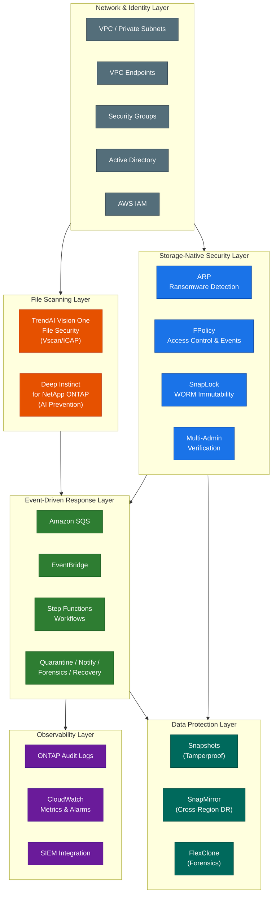
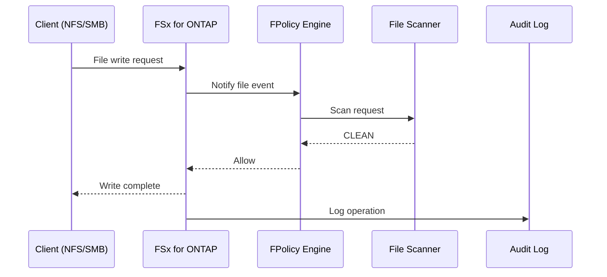
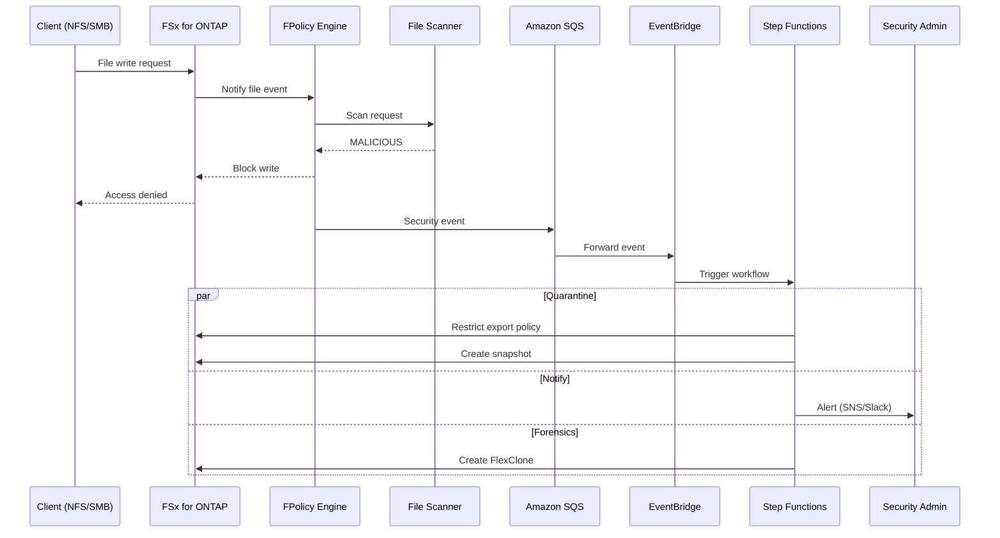
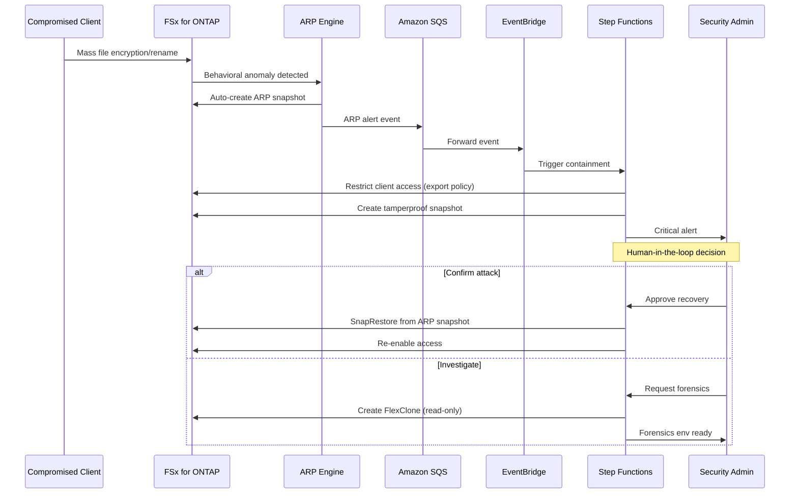
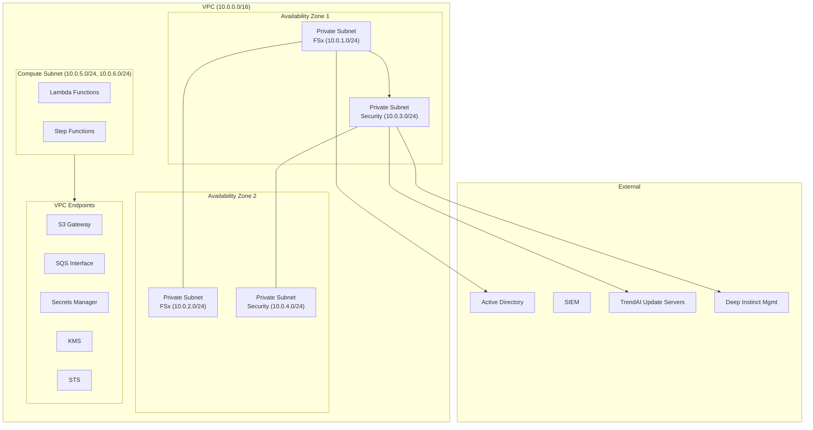
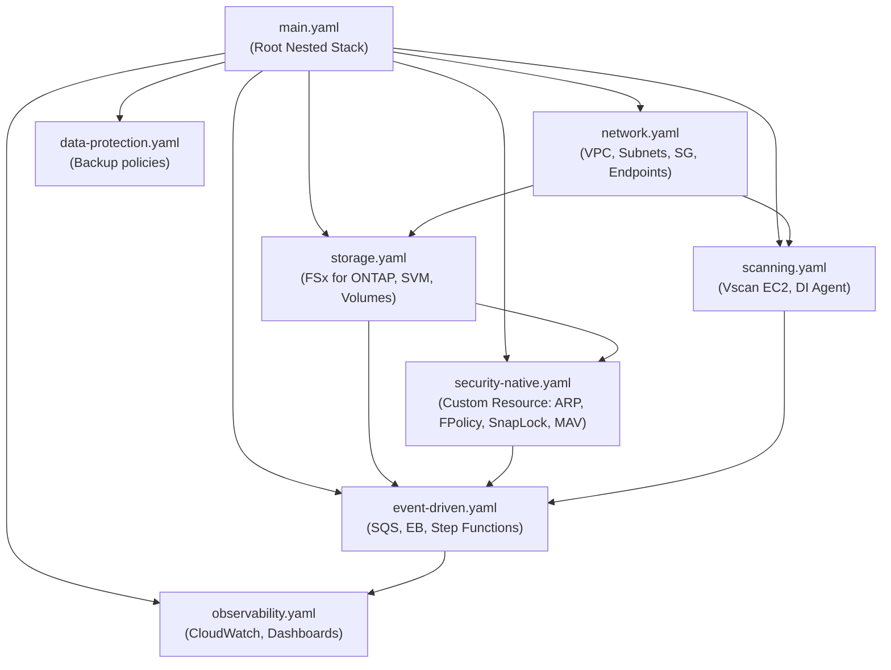

# FSx for ONTAP Cyber Resilience — Architecture Overview

## アーキテクチャ概要 / Architecture Overview

Amazon FSx for NetApp ONTAP を中心とした多層防御（Defense in Depth）アーキテクチャ。
ストレージネイティブセキュリティ、AI ベースのファイルスキャン、イベント駆動型自動対応を組み合わせ、
ランサムウェアおよび高度な脅威からエンタープライズファイルデータを保護する。

This architecture combines storage-native security, AI-powered file scanning, and event-driven automated response
around Amazon FSx for NetApp ONTAP to protect enterprise file data against ransomware and advanced threats
through defense-in-depth.

---

## 多層防御アーキテクチャ / Defense-in-Depth Architecture



---

## セキュリティレイヤー詳細 / Security Layer Details

### Layer 1: Storage-Native Security（ストレージネイティブセキュリティ）

FSx for ONTAP に組み込まれたセキュリティ機能。追加コンポーネント不要で即座に有効化可能。

| Component | 機能 / Function | 防御フェーズ / Phase |
|-----------|----------------|---------------------|
| **ARP** (Autonomous Ransomware Protection) | ファイル操作パターンの異常検知、自動 Snapshot 作成 | 検知 (Detect) |
| **FPolicy** | ファイルアクセスイベントの監視・通知・ブロック | 検知・防御 (Detect / Protect) |
| **SnapLock** | WORM によるデータ不変性（Compliance / Enterprise） | 防御 (Protect) |
| **Tamperproof Snapshot** | 管理者でも削除不可能な Snapshot | 防御 (Protect) |
| **Multi-Admin Verification** | 破壊的操作の多者承認 | 防御 (Protect) |

### Layer 2: File Scanning（ファイルスキャン）

書き込み時のリアルタイムスキャンにより、マルウェアの侵入を防止。

| Technology | アプローチ / Approach | 強み / Strength |
|-----------|---------------------|----------------|
| **TrendAI Vision One — File Security** | シグネチャ + ヒューリスティック (Vscan/ICAP) | 既知脅威の高精度検知、低偽陽性 |
| **Deep Instinct for NetApp ONTAP** | Deep Learning 推論 (予防型) | 未知脅威・ゼロデイの事前防御 |

### Layer 3: Event-Driven Response（イベント駆動対応）

検知イベントから自動的に封じ込め・通知・証拠保全を実行。

```
FPolicy / ARP Event → SQS → EventBridge → Step Functions → Actions
```

| Workflow | トリガー / Trigger | アクション / Actions |
|----------|-------------------|---------------------|
| **Quarantine** | マルウェア検知、ARP アラート | Export Policy 制限、Snapshot 作成 |
| **Notification** | 全セキュリティイベント | SNS、Slack、Teams 通知 |
| **Forensics** | 高重要度イベント | FlexClone 作成、証拠保全 |
| **Recovery** | 管理者承認後 | SnapRestore、Export Policy 復旧 |

### Layer 4: Observability（可観測性）

全操作の監査証跡と、セキュリティメトリクスのリアルタイム監視。

```
ONTAP Audit → S3 AP → Lambda → SIEM
CloudWatch Metrics → Alarms → SNS
```

### Layer 5: Data Protection（データ保護）

攻撃からの復旧と証拠保全のための ONTAP ネイティブ機能群。

| Feature | 用途 / Use Case | RPO |
|---------|----------------|-----|
| **Snapshot** | 短期復旧ポイント | 分単位 |
| **Tamperproof Snapshot** | 改ざん防止バックアップ | ポリシー定義 |
| **FlexClone** | フォレンジック環境分離 | 即時 |
| **SnapMirror** | Cross-Region DR | 最終同期時点 |
| **SnapLock** | コンプライアンス長期保持 | コミット時点 |

---

## データフロー / Data Flow

### 通常時（Normal Operation）



### 脅威検知時（Threat Detected）



### ARP ランサムウェア検知時（ARP Detection）



---

## ネットワーク構成 / Network Architecture



> **Note**: EventBridge は Regional service のため VPC Endpoint は不要。全サブネットは Multi-AZ 配置。
> 詳細なネットワーク設計（ポート定義、Security Group ルール等）は内部設計ドキュメントを参照。

---

## CloudFormation テンプレート構成 / CloudFormation Template Structure



各テンプレートは Nested Stack として `main.yaml` から参照されるか、個別にデプロイ可能。
環境別パラメータは `parameters/dev.json`, `parameters/staging.json`, `parameters/production.json` で管理。

---

## NIST CSF 2.0 マッピング / NIST Cybersecurity Framework 2.0 Mapping

| NIST CSF 2.0 Function | このアーキテクチャでの実装 / Implementation |
|------------------------|-------------------------------------------|
| **Govern** | データ分類、ポリシー定義、MAV による変更管理、役割分離 |
| **Identify** | 資産管理 (SVM/Volume/Share 単位), データ分類レベル定義 |
| **Protect** | FPolicy ブロック, SnapLock, Tamperproof Snapshot, MAV, File Scanning, Export Policy |
| **Detect** | ARP 異常検知, FPolicy 監視, File Scanning verdict, CloudWatch Alarms |
| **Respond** | Step Functions 自動隔離, 通知, フォレンジック, Human-in-the-loop 承認 |
| **Recover** | ARP Snapshot 復元, SnapMirror DR, FlexClone 検証環境, ランブック |

---

## 関連プロジェクト / Related Projects

| Project | Relationship |
|---------|-------------|
| [fsxn-observability-integrations](https://github.com/Yoshiki0705/fsxn-observability-integrations) | 監査ログ SIEM 配信基盤（本プロジェクトの Observability Layer 基盤） |
| [FSx-for-ONTAP-S3AccessPoints-Serverless-Patterns](https://github.com/Yoshiki0705/FSx-for-ONTAP-S3AccessPoints-Serverless-Patterns) | S3 AP パターン参照実装、FPolicy イベント処理パターン |
| [blea-fsxn-usecase](https://github.com/Yoshiki0705/blea-fsxn-usecase) | BLEA Cyber Resilience ユースケース CDK 実装 |

---

## 次のステップ / Next Steps

**Phase 1 Complete (現在):**
- ✅ Network Stack + Storage Stack (CloudFormation)
- ✅ ONTAP Native Security 設定 (ARP / FPolicy Custom Resource)
- ✅ Event-Driven Response パイプライン (SQS → EventBridge → Step Functions)
- ✅ File Scanning テンプレート (TrendAI / Deep Instinct EC2)
- ✅ Observability Dashboard + Alarms (CloudWatch)
- ✅ Lambda コードパッケージング + S3 デプロイ
- ✅ セキュリティ強化 (IMDSv2, VPC Flow Logs, Lambda concurrency)
- ✅ CI/CD (cfn-lint, cfn-guard, pytest, coverage)

**Phase 2 (Production Readiness):**
1. Multi-AZ Scanner HA (Auto Scaling Group)
2. ARP Lifecycle Manager (dry_run → enabled 自動移行)
3. DR / SnapMirror Cross-Region レプリケーション
4. Multi-Admin Verification (MAV) 統合
5. コスト最適化 (dev 環境のスキャナー時間帯停止)
6. 運用ランブック拡充

**Phase 3 (Enterprise Extensions):**
1. AWS Security Hub 統合
2. Third-party SIEM 連携 (Splunk / QRadar)
3. コンプライアンス証跡自動収集 (SOC2 / ISO27001 マッピング)
4. マルチアカウント Hub-Spoke パターン
5. パフォーマンスベンチマーク
