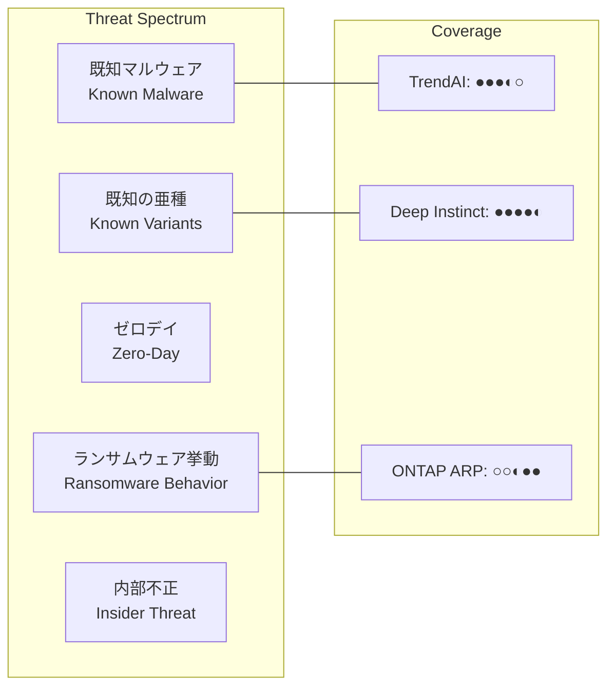
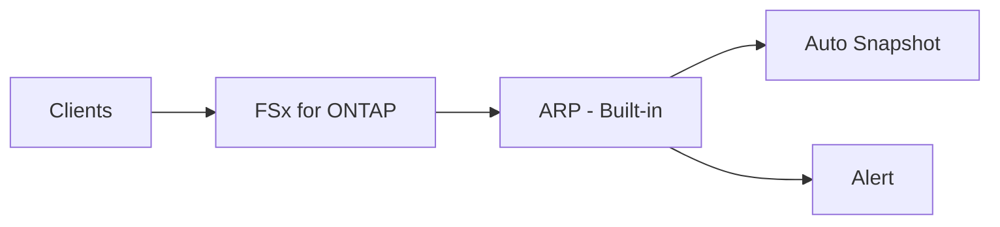
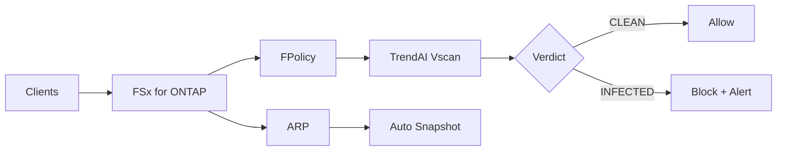
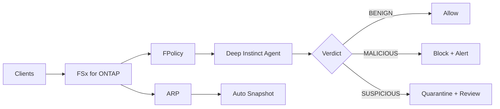
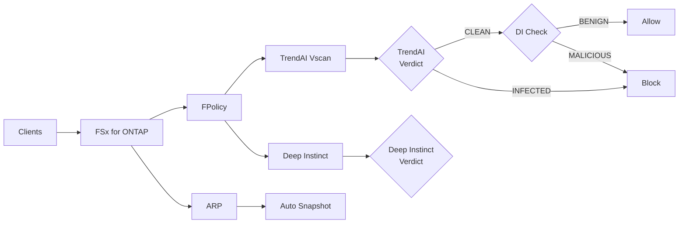
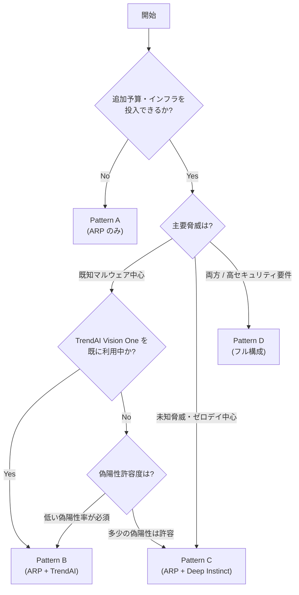

# Security Layer Comparison: ONTAP ARP vs TrendAI File Security vs Deep Instinct

## Table of Contents / 目次

- [テクノロジー概要 / Technology Overview](#テクノロジー概要--technology-overview)
- [特性比較 / Feature Comparison](#特性比較--feature-comparison)
- [強みとトレードオフ / Strengths and Trade-offs](#強みとトレードオフ--strengths-and-trade-offs)
- [検知カバレッジの補完関係 / Complementary Detection Coverage](#検知カバレッジの補完関係--complementary-detection-coverage)
- [導入パターン / Deployment Patterns](#導入パターン--deployment-patterns)
- [選び方 / How to Choose](#選び方--how-to-choose)
- [パフォーマンスへの影響 / Performance Impact](#パフォーマンスへの影響--performance-impact-considerations)
- [コスト構造 / Cost Structure](#コスト構造--cost-structure)
- [推奨アプローチ / Recommended Approach](#推奨アプローチ--recommended-approach)
- [免責事項 / Disclaimer](#免責事項--disclaimer)

---

## セキュリティレイヤー比較 / Security Layer Comparison

このドキュメントでは、FSx for ONTAP 環境で利用可能な3つのセキュリティテクノロジーを中立的に比較する。
これらは相互に排他的な選択肢ではなく、多層防御における補完的レイヤーである。

This document provides a neutral comparison of three security technologies available for FSx for ONTAP environments.
These are not mutually exclusive alternatives but complementary layers in a defense-in-depth strategy.

---

## テクノロジー概要 / Technology Overview

### ONTAP Autonomous Ransomware Protection (ARP)

ストレージコントローラ内蔵の行動分析エンジン。ファイル操作パターンの異常（大量リネーム、エントロピー変化、拡張子変更）を検知し、自動で保護 Snapshot を作成する。

Built-in behavioral analysis engine within the storage controller. Detects anomalies in file operation patterns (mass renames, entropy changes, extension modifications) and automatically creates protective snapshots.

### TrendAI Vision One — File Security

TrendAI（トレンドマイクロ法人向けブランド）が提供するファイルストレージ向けセキュリティソリューション。シグネチャベース + ヒューリスティック分析により、既知マルウェアをファイル書き込み時にリアルタイム検知・ブロックする。ONTAP Vscan (ICAP プロトコル) 統合で動作。

File storage security solution from TrendAI (Trend Micro's enterprise brand). Uses signature-based + heuristic analysis to detect and block known malware in real-time during file writes. Operates via ONTAP Vscan (ICAP protocol) integration.

### Deep Instinct for NetApp ONTAP

Deep Learning（深層学習）による推論ベースの予防型セキュリティ。従来のシグネチャやヒューリスティックに依存せず、ファイルの構造そのものを AI が分析して悪意の有無を判定する。未知脅威・ゼロデイに対する事前防御を目的とする。

Deep learning inference-based preventive security. Analyzes file structure itself using AI without relying on traditional signatures or heuristics. Designed for pre-emptive defense against unknown threats and zero-day attacks.

---

## 特性比較 / Feature Comparison

| 観点 / Aspect | ONTAP ARP | TrendAI File Security | Deep Instinct |
|--------------|-----------|----------------------|---------------|
| **検知アプローチ** | 行動分析（操作パターン） | シグネチャ + ヒューリスティック | Deep Learning 推論 |
| **検知対象** | ランサムウェア的挙動 | 既知マルウェア全般 | 未知脅威・ゼロデイ |
| **動作レイヤー** | ストレージコントローラ内 | 外部スキャンサーバー (EC2) | 外部エージェント (EC2) |
| **追加インフラ** | 不要（ONTAP 内蔵） | Vscan サーバー EC2 必要 | Agent サーバー EC2 必要 |
| **ブロック能力** | 直接ブロックなし（検知＋Snapshot） | 書き込みブロック可能（FPolicy 連携） | 書き込みブロック可能（FPolicy 連携） |
| **レスポンスタイム** | 秒〜分（パターン蓄積後） | ミリ秒（インラインスキャン） | ミリ秒（推論完了時） |
| **偽陽性リスク** | 中（学習期間依存） | 低（シグネチャ精度高い） | 低〜中（モデル依存） |
| **シグネチャ更新** | 不要（行動ベース） | 必要（自動更新） | 不要（モデルベース） |
| **ONTAP 統合** | ネイティブ（設定のみ） | Vscan/ICAP 標準統合 | FPolicy / API 統合 |
| **ライセンス** | FSx for ONTAP 利用料に含まれる（追加課金なし） | 別途商用ライセンス | 別途商用ライセンス |
| **運用負荷** | 低（設定後は自動） | 中（サーバー運用、更新管理） | 中（サーバー運用、モデル管理） |

---

## 強みとトレードオフ / Strengths and Trade-offs

### ONTAP ARP

| 強み / Strengths | トレードオフ / Trade-offs |
|-----------------|-------------------------|
| 追加コスト・インフラ不要 | 個別ファイルのマルウェア判定はできない |
| ストレージレイヤーで完結（低レイテンシ） | 行動パターン蓄積に学習期間が必要（推奨30日+） |
| 自動 Snapshot による即時復旧ポイント確保 | 低速な暗号化攻撃は検知困難 |
| 全プロトコル（NFS/SMB/S3 AP）で動作 | 既知マルウェアのシグネチャ判定はできない |
| FSx for ONTAP 9.15.1+ で AI 強化版利用可能 | 検知精度は ONTAP バージョンに依存 |
| 学習モード→アクティブモードの段階的有効化 | 学習期間中は検知のみ（ブロック不可） |

### TrendAI Vision One — File Security

| 強み / Strengths | トレードオフ / Trade-offs |
|-----------------|-------------------------|
| 既知マルウェアの高精度検知 | シグネチャ未対応の未知脅威は検知困難 |
| 業界実績のある検知エンジン | EC2 上の Vscan サーバー運用が必要 |
| 低い偽陽性率 | スキャンサーバー障害時のフォールバック設計が必要 |
| ONTAP Vscan 標準統合で導入が容易 | ファイル書き込み時のレイテンシ増加 |
| Vision One プラットフォームとの統合分析 | 商用ライセンスコスト |
| AWS Marketplace ソリューションとして利用可能 | 大量同時書き込み時のスキャンサーバースケーリング |

### Deep Instinct for NetApp ONTAP

| 強み / Strengths | トレードオフ / Trade-offs |
|-----------------|-------------------------|
| 未知脅威・ゼロデイの事前防御 | AI モデルの判定理由の説明性（Explainability）が限定的 |
| シグネチャ更新不要（モデルベース） | 正規ファイルの誤検知（False Positive）への運用対応が必要 |
| 高速推論（ミリ秒オーダー） | EC2 上の Agent 運用が必要 |
| Prevention モードで書き込み前ブロック可能 | 商用ライセンスコスト |
| オフライン環境でも動作可能 | モデル更新サイクルの管理 |
| 既知マルウェアも検知可能 | 特定ファイル形式への対応範囲はモデル依存 |

---

## 検知カバレッジの補完関係 / Complementary Detection Coverage

| 脅威タイプ / Threat Type | ONTAP ARP | TrendAI | Deep Instinct |
|-------------------------|-----------|---------|---------------|
| 既知マルウェア（シグネチャあり） | — | ◎ 最適 | ○ 検知可能 |
| 既知マルウェアの亜種 | — | ○ ヒューリスティック | ◎ 推論で検知 |
| ゼロデイ（完全未知） | △ 行動で間接検知 | △ ヒューリスティック依存 | ◎ 推論で検知 |
| ランサムウェア（暗号化行動） | ◎ 行動分析で検知 | ○ ファイル単体で検知 | ○ ファイル単体で検知 |
| 低速ランサムウェア（少量ずつ暗号化） | △ パターン蓄積に時間 | ○ 個別ファイルスキャン | ○ 個別ファイルスキャン |
| ファイルレス攻撃 | ◎ 操作行動で検知 | — 対象外 | — 対象外 |
| 内部不正（正当アカウントでの大量コピー） | ○ 異常行動として検知 | — 対象外 | — 対象外 |

凡例: ◎ = 最も適した技術、○ = 検知可能、△ = 一定条件下で検知、— = 対象外

---

## 導入パターン / Deployment Patterns

### Pattern A: 最小構成（ONTAP ARP のみ）

追加コスト・インフラなしで基本的なランサムウェア防御を実現。

**適している環境 / Suited for:**
- 追加予算が限定的
- まず最小限の防御を即座に有効化したい
- PoC / 評価フェーズ

**考慮事項 / Considerations:**
- 個別ファイルのマルウェア判定はできない
- 検知は行動パターンに限定される

---

### Pattern B: シグネチャベース防御（ARP + TrendAI）

既知脅威のリアルタイムブロック + ランサムウェア行動検知。

**適している環境 / Suited for:**
- 既知マルウェアの確実なブロックが最優先
- 低い偽陽性率が求められる環境
- TrendAI Vision One を既に他の用途で利用中

**考慮事項 / Considerations:**
- シグネチャ未対応の新種は通過する可能性
- Vscan サーバーの運用管理が必要

---

### Pattern C: AI 予防型防御（ARP + Deep Instinct）

未知脅威の事前防御 + ランサムウェア行動検知。

**適している環境 / Suited for:**
- ゼロデイ・未知脅威が主要リスク
- シグネチャ更新の運用負荷を避けたい
- AI ベースの防御に投資する方針

**考慮事項 / Considerations:**
- 偽陽性の運用対応プロセスが必要
- 既知マルウェアに対する検知精度は TrendAI に劣る場合がある

---

### Pattern D: 多層防御フル構成（ARP + TrendAI + Deep Instinct）

全レイヤーを組み合わせた最高レベルの防御。

**適している環境 / Suited for:**
- 金融、医療、政府機関など高セキュリティ要件の環境
- ゼロトラストアーキテクチャの一部として多層防御を実装する環境
- 規制要件で多層スキャンが求められる環境

> **Important note**: Pattern D は最も包括的だが、多くの環境にとっては過剰投資（over-engineered）となりうる。
> Pattern B または C で一般的な脅威の 90% 以上をカバーできる。
> 規制要件で明確に「多層スキャン」が求められない限り、Pattern B/C から開始し、必要に応じて拡張するアプローチを推奨する。

**考慮事項 / Considerations:**
- 運用コスト（ライセンス + インフラ + 人員）が最大
- 書き込みレイテンシへの影響が累積する
- 二重スキャンによるリソース消費
- 偽陽性の相関分析が複雑

---

## 選び方 / How to Choose

### 意思決定フローチャート / Decision Flowchart

### 選定基準マトリクス / Selection Criteria Matrix

| 判断基準 / Criteria | Pattern A | Pattern B | Pattern C | Pattern D |
|--------------------|-----------|-----------|-----------|-----------|
| 初期コスト | ◎ 最低 | ○ 中 | ○ 中 | △ 高 |
| 運用コスト | ◎ 最低 | ○ 中 | ○ 中 | △ 高 |
| 既知マルウェア防御 | △ | ◎ | ○ | ◎ |
| 未知脅威防御 | △ | △ | ◎ | ◎ |
| ランサムウェア防御 | ○ | ◎ | ◎ | ◎ |
| 運用複雑度 | ◎ 最低 | ○ 中 | ○ 中 | △ 高 |
| レイテンシ影響 | ◎ 最小 | ○ 中 | ○ 中 | △ 大 |
| 導入速度 | ◎ 即時 | ○ 数日 | ○ 数日 | △ 数週間 |

---

## パフォーマンスへの影響 / Performance Impact Considerations

| Technology | 書き込みレイテンシ増加 | スループット影響 | 緩和策 |
|-----------|---------------------|----------------|--------|
| ONTAP ARP | < 1ms（ストレージ内処理） | 無視できる | — |
| TrendAI (Vscan) | 5-30ms (ファイルサイズ依存) | スキャンサーバースケールで緩和 | FPolicy フィルタで対象限定、passthrough-read-open |
| Deep Instinct | 5-20ms (推論時間) | Agent スケールで緩和 | FPolicy フィルタで対象限定、Prevention/Detection モード選択 |
| 全レイヤー併用 | 10-50ms (累積) | 設計上の最大値 | 並列スキャン検討、フィルタリング最適化 |

> **Note**: 上記は概算であり、実環境のファイルサイズ、ネットワーク構成、サーバースペックにより変動する。
> 本番導入前に PoC 環境でのベンチマーク実施を推奨する。

---

## コスト構造 / Cost Structure

| Component | コスト要素 / Cost Elements |
|-----------|--------------------------|
| ONTAP ARP | FSx for ONTAP 利用料に含まれる（追加コストなし） |
| TrendAI File Security | ライセンス費 + EC2 (Vscan サーバー) + ネットワーク転送 |
| Deep Instinct | ライセンス費 + EC2 (Agent) + ネットワーク転送 |
| Event-Driven Response | SQS + EventBridge + Step Functions + Lambda (従量課金) |
| Data Protection | Snapshot ストレージ + SnapMirror 転送（FSx for ONTAP 料金体系内） |

> **Tip**: コスト最適化のためには、FPolicy フィルタリングでスキャン対象を制御することが重要。
> 全ファイルを無条件にスキャンせず、リスクベースで対象を選定する。

---

## サイジングガイド（目安） / Sizing Guide

以下は参考値であり、実環境のワークロードプロファイルに基づく PoC 検証を推奨する。

### FSx for ONTAP スループットキャパシティ目安

| 環境規模 | ユーザー数 | データ量 | 推奨スループット | 推奨 SSD 容量 |
|---------|-----------|---------|----------------|--------------|
| PoC/検証 | ~10 | ~1 TB | 128 MB/s | 1,024 GiB |
| 中小規模 | ~100 | ~10 TB | 256-512 MB/s | 2,048-5,120 GiB |
| 大規模 | ~1,000 | ~100 TB | 1,024-2,048 MB/s | 10,240+ GiB |

### Vscan / Deep Instinct サーバーの目安

| 同時書き込み ops/sec | Vscan EC2 台数 | DI Agent EC2 台数 | インスタンスタイプ |
|---------------------|---------------|-------------------|------------------|
| ~100 | 1 | 1 | c6i.xlarge |
| ~500 | 2 | 2 | c6i.2xlarge |
| ~1,000+ | 3+ (ALB) | 3+ | c6i.2xlarge+ |

> **Note**: サーバー台数はスキャン対象のファイルサイズ分布に強く依存する。
> 大容量ファイル（>100MB）が多い場合は上記より多くのリソースが必要。
> 本番導入前にワークロードプロファイリングと PoC ベンチマークを必須とする。

---

## 推奨アプローチ / Recommended Approach

### PoC クイックスタート（3日間検証セット） / PoC Quick Start (3-Day Validation)

Partner/SI が顧客環境で最小限の PoC を実施するための手順。

**Estimated PoC Cost (3 days, ap-northeast-1):**
- FSx for ONTAP Single-AZ 128 MB/s, 1024 GiB: ~$15/day
- c6i.xlarge (Vscan or DI Agent): ~$5/day
- Lambda, SQS, EventBridge: < $1/day (minimal usage)
- **Total: approximately $60-70 for 3-day PoC**

| Day | Activity | 成果物 / Deliverable |
|-----|----------|---------------------|
| Day 1 | FSx for ONTAP (Single-AZ) デプロイ + ARP 学習モード有効化 + FPolicy async 設定 | 基盤稼働確認 |
| Day 2 | テストファイル書き込み + ARP 学習確認 + FPolicy イベント確認 (CloudWatch Logs) | イベントフロー確認 |
| Day 3 | EICAR テストファイルでスキャン検証（TrendAI or DI）+ 隔離動作確認 | End-to-end 検証完了 |

> **Note**: ARP はアクティブモード移行に30日+が必要なため、PoC では学習モードでのイベント確認までとする。
> フルスキャン検証には Day 2 で Vscan サーバーまたは DI Agent の追加デプロイが必要。

### 段階的導入 / Phased Adoption

ほとんどの環境では、段階的に防御レイヤーを追加することを推奨する。

| Phase | Action | 期間目安 |
|-------|--------|---------|
| Phase 1 | ARP 有効化 + Tamperproof Snapshot | 1日 |
| Phase 2 | FPolicy 設定 + EventBridge 連携 | 1-2週間 |
| Phase 3 | TrendAI または Deep Instinct 導入（要件に応じて選択） | 2-4週間 |
| Phase 4 | フル構成 + 自動レスポンス + 監視ダッシュボード | 4-8週間 |

### 選択の判断基準 / Selection Guidance

**TrendAI File Security を優先する場合:**
- コンプライアンス要件でシグネチャベーススキャンが必須
- 既に TrendAI Vision One エコシステムを利用中
- 偽陽性を最小限に抑えたい
- AWS Marketplace ソリューションとしてワンストップで調達したい

**Deep Instinct を優先する場合:**
- 未知脅威・ゼロデイが主要な懸念事項
- シグネチャ更新の運用負荷を避けたい
- AI ベースセキュリティへの投資方針がある
- オフライン/エアギャップ環境での利用がある

**両方を導入する場合:**
- 金融、医療、政府機関などの高セキュリティ環境
- ゼロトラストアーキテクチャの全面採用
- 規制要件で多層スキャンが求められる

---

## 免責事項 / Disclaimer

- 本ドキュメントはリファレンスアーキテクチャとしての技術比較であり、特定製品の推奨・非推奨を意味しない
- 検知精度、パフォーマンス数値は公開情報に基づく概算であり、実環境では異なる場合がある
- 製品固有の機能、価格、サポートについては各ベンダーの最新ドキュメントを参照すること
- 本比較は 2026年6月時点の情報に基づく。各製品は継続的に機能強化されている
- 著者は NetApp 所属の Cloud Solutions Architect です。ベンダー中立な記述を心がけていますが、読者は著者の所属を考慮の上でご判断ください

---

## AWS-Native Alternatives / AWS ネイティブ代替手段

本ドキュメントは FSx for ONTAP の NAS ワークロード保護に特化しているが、AWS エコシステムにはファイル/データ保護に関連する以下のサービスが存在する。ユースケースに応じて検討すべき選択肢として記載する。

| AWS Service | 対象 | 強み | FSx for ONTAP との関係 |
|------------|------|------|----------------------|
| **Amazon GuardDuty Malware Protection** | EBS, S3, ECS/EKS | エージェントレスマルウェアスキャン | NFS/SMB ファイルアクセスには非対応。FSx for ONTAP + Vscan が補完 |
| **AWS Backup + Vault Lock** | 全 AWS バックアップ対象 | イミュータブルバックアップ | SnapLock / Tamperproof Snapshot と同等の不変性。FSx for ONTAP は AWS Backup も利用可能 |
| **Amazon Macie** | S3 | 機密データ分類・検出 | S3 AP 経由で FSx for ONTAP データにも適用可能 |
| **AWS Security Hub** | 全 AWS リソース | セキュリティスコアリング | EventBridge 連携で本アーキテクチャのアラートを集約可能 |

> **使い分けの考え方**: NAS ワークロード（NFS/SMB でアクセスするファイルサーバー）を保護する場合、GuardDuty やMacie だけでは不十分であり、ストレージレイヤーでの FPolicy + Vscan/DI + ARP が必要。一方、S3 や EBS 中心のワークロードでは GuardDuty Malware Protection が first choice になる。

---

## References

- [Amazon FSx for NetApp ONTAP — Documentation](https://docs.aws.amazon.com/fsx/latest/ONTAPGuide/)
- [NetApp ONTAP — Autonomous Ransomware Protection](https://docs.netapp.com/us-en/ontap/anti-ransomware/)
- [NetApp ONTAP — FPolicy](https://docs.netapp.com/us-en/ontap/nas-audit/fpolicy-config-types-concept.html)
- [TrendAI Vision One — File Security](https://www.trendmicro.com/en_us/business/products/network-security/file-storage-security.html)
- [Deep Instinct for NetApp ONTAP](https://www.deepinstinct.com/partners/netapp)
