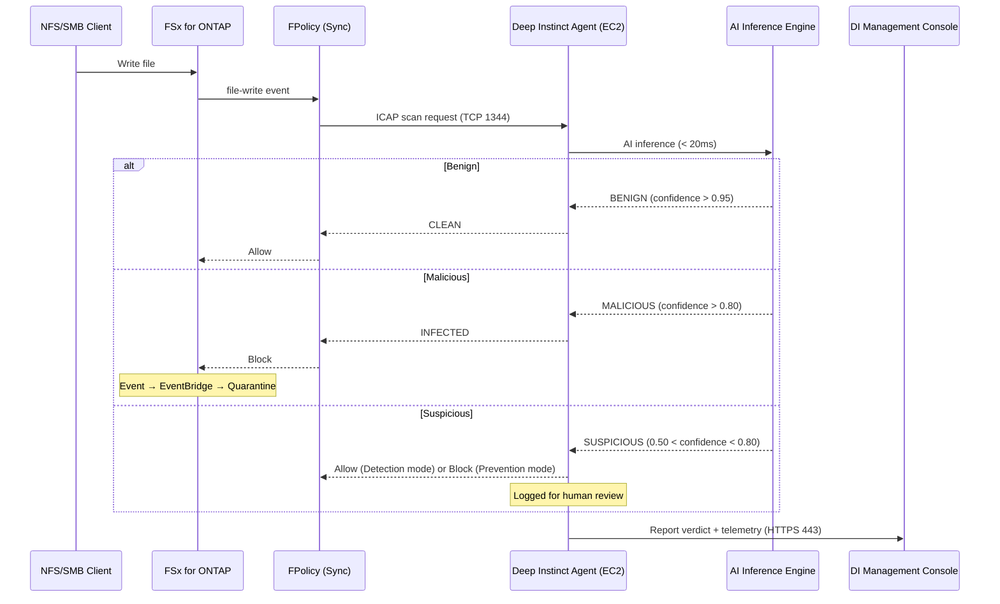

# Deep Instinct for NetApp ONTAP — Architecture

## 概要 / Overview

Deep Instinct は Deep Learning (深層学習) による推論ベースのセキュリティソリューション。
シグネチャに依存せず、ファイルの構造そのものを AI モデルが分析して悪意の有無を判定する。
FSx for ONTAP とは FPolicy/ICAP 経由で統合し、未知脅威・ゼロデイの事前防御を実現する。

## Architecture Diagram

## Prevention vs Detection Mode

| Mode | Behavior on MALICIOUS | Behavior on SUSPICIOUS | Use Case |
|------|----------------------|----------------------|----------|
| **Prevention** | Block + Alert | Block + Alert | 本番環境（偽陽性リスク承認済み） |
| **Detection** | Block + Alert | Allow + Log | 評価フェーズ / 偽陽性チューニング中 |

> **推奨**: 初期導入は Detection モードで開始 → 偽陽性率が安定したら Prevention に移行。

## EC2 Agent Requirements

| Aspect | Specification |
|--------|--------------|
| Instance type | c6i.xlarge (推論最適化) ~ c6i.2xlarge |
| OS | Ubuntu 22.04 LTS or RHEL 9 |
| Subnet | Security subnet (sg-deep-instinct) |
| Inbound | TCP 1344 from sg-fsx only |
| Outbound | TCP 443 to Deep Instinct management (via NAT) |
| IMDSv2 | Required |
| GPU | 不要（CPU 推論で十分な速度） |
| Storage | 100 GiB gp3 (AI モデル + ログ) |

## TrendAI File Security との棲み分け

| Aspect | TrendAI | Deep Instinct |
|--------|---------|---------------|
| Primary strength | 既知マルウェアの高精度検知 | 未知脅威・ゼロデイの事前防御 |
| Detection method | シグネチャ + ヒューリスティック | Deep Learning 推論 |
| Signature updates | 必要（定期更新） | 不要（モデル更新は数ヶ月単位） |
| False positive rate | Very low | Low-Medium (モデル依存) |
| Offline operation | 制限あり | 完全対応 |
| Best for | コンプライアンス要件、既知脅威ブロック | APT 対策、新種ランサムウェア |

両方を導入する場合は FPolicy で2つのポリシーを定義し、直列スキャン（TrendAI → DI）とする。

## False Positive 対策

1. **Detection モードでの運用開始** (最低2週間)
2. **ホワイトリスト** — 業務アプリケーションの正常ファイルを除外
3. **Confidence threshold 調整** — DI 管理コンソールでしきい値チューニング
4. **定期レビュー** — 週次で誤検知レポートを確認し、ポリシー調整

## References

- [Deep Instinct for NetApp ONTAP](https://www.deepinstinct.com/partners/netapp)
- [Deep Instinct — Prevention Platform](https://www.deepinstinct.com/platform)
