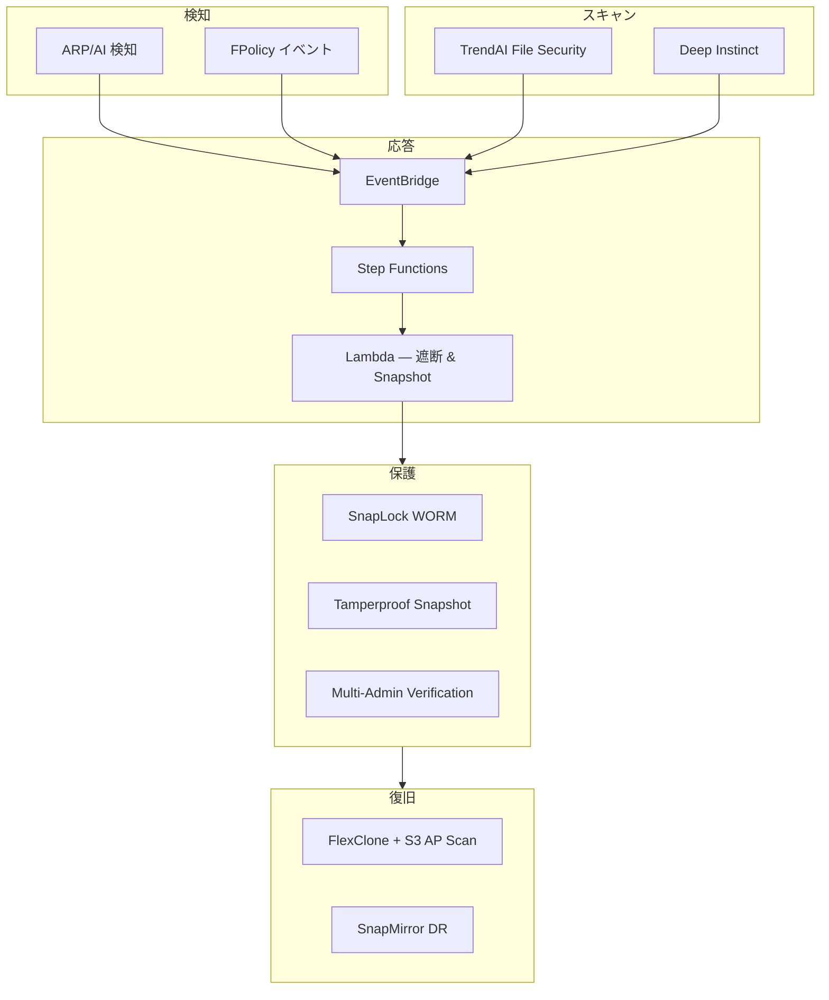

# FSx for ONTAP Cyber Resilience Patterns

[](https://github.com/Yoshiki0705/fsxn-cyber-resilience-patterns/actions/workflows/ci.yml)
[](https://scorecard.dev/viewer/?uri=github.com/Yoshiki0705/fsxn-cyber-resilience-patterns)
[](../../LICENSE)

🌐 **Language**: [English](../../README.md) | 日本語

> NAS 上のファイルがランサムウェアで暗号化され始めたら？ 本プロジェクトは数秒以内に検知し、ストレージ層で攻撃者のアクセスを自動遮断します。すべて CloudFormation でデプロイ可能です。

Amazon FSx for NetApp ONTAP 向けの多層サイバーレジリエンスパターン — ストレージネイティブセキュリティ、AI 脅威防御、イベント駆動型自動応答を組み合わせたリファレンスアーキテクチャです。

## はじめる / Get Started

| やりたいこと | ガイド | 所要時間 |
|-------------|--------|---------|
| アーキテクチャを理解する | [Architecture Overview](../architecture/overview.md) | 10 min |
| 新規環境にデプロイする | [デプロイガイド](deployment-guide.md) | 45 min |
| 既存 FSx for ONTAP に追加する | [既存環境ガイド](../deployment-guide-existing-fsxn.md) | 30 min |
| ARP アラートに対応する | [ARP Alert Triage Runbook](../runbooks/arp-alert-triage.md) | 5 min |
| ランサムウェア復旧を実行する | [Recovery Runbook](../runbooks/ransomware-recovery.md) | 15 min |
| セキュリティ層を比較する | [Security Layer Comparison](../comparison-security-layers.md) | 10 min |

## アーキテクチャ



| レイヤー | テクノロジー | 役割 |
|---------|-------------|------|
| ストレージネイティブ | ARP, FPolicy, SnapLock, Tamperproof Snapshot, MAV | 検知 & 不変性 |
| ファイルスキャン | TrendAI Vision One File Security | リアルタイムマルウェア検知 (Vscan/ICAP) |
| AI 防御 | Deep Instinct for NetApp ONTAP | ゼロデイ脅威防御 |
| イベント駆動 | FPolicy → EventBridge → Step Functions | 自動隔離 & 応答 |
| データ保護 | Snapshot, SnapMirror, FlexClone | 復旧 & 証拠保全 |

<details>
<summary>📂 全パターン一覧</summary>

| ソリューション | ディレクトリ | 説明 |
|--------------|------------|------|
| ONTAP ネイティブセキュリティ | `solutions/ontap-native/` | ARP, FPolicy, SnapLock, MAV 構成 |
| TrendAI File Security | `solutions/trendai-file-security/` | Vision One Vscan/ICAP + S3 AP 統合 |
| Deep Instinct | `solutions/deep-instinct/` | AI ファイルスキャンパターン |
| イベント駆動応答 | `solutions/event-driven-response/` | FPolicy → EventBridge → Step Functions |
| 可観測性 | `solutions/observability/` | セキュリティメトリクス & CloudWatch ダッシュボード |
| SIEM 統合 | `solutions/siem/` | Security Hub, Splunk/QRadar/CEF コネクター |
| コンプライアンス | `solutions/compliance/` | SOC2/ISO27001 証跡収集 |
| 共有ライブラリ | `solutions/shared/` | ONTAP REST API クライアント |

</details>

<details>
<summary>⚠️ 制約・注意事項</summary>

| 制約 | 影響 | 緩和策 |
|-----|------|--------|
| SMB 遮断は SVM 全体に影響 | 対象ボリュームだけでなく全共有が影響 | 高リスクワークロードを専用 SVM に分離 |
| NTFS ボリューム: name-mapping deny 無効 | AD アカウント無効化 or NACL が必要 | [運用上の注意事項](operational-considerations.md) 参照 |
| Domain Admins は遮断をバイパス | `FileSystemAdministratorsGroup` メンバーは影響を受けない | 非管理者ユーザーでテスト |
| 同一サブネット NACL 無効 | export-policy deny のみが有効 | クライアントと FSx ENI を別サブネットに配置 |

詳細: [運用上の注意事項](operational-considerations.md) | [NIST CSF 2.0 フレームワークマッピング](cyber-resilience-framework-mapping.md)

</details>

<details>
<summary>📚 関連プロジェクト・記事</summary>

### コンパニオンリポジトリ

| リポジトリ | 関係 |
|-----------|------|
| [FSx for ONTAP Observability Integrations](https://github.com/Yoshiki0705/fsxn-observability-integrations) | 検知 & 応答プリミティブ（自動遮断、EMS パイプライン、検証済み復旧） |
| [FSx for ONTAP S3 Access Points Serverless Patterns](https://github.com/Yoshiki0705/FSx-for-ONTAP-S3AccessPoints-Serverless-Patterns) | 監査 & 復旧ワークフローで使用する S3 AP ライフサイクルパターン |
| [FSx for ONTAP Agentic Access-Aware RAG](https://github.com/Yoshiki0705/FSx-for-ONTAP-Agentic-Access-Aware-RAG) | 本リポジトリが保護する同じデータ上でのパーミッション認識 AI/RAG |

統合ガイド: [JA](companion-repos-integration.md) | [EN](../en/companion-repos-integration.md)

### 記事

- [Amazon FSx for NetApp ONTAP の自動アクセス遮断](https://hakobiya.hatenablog.com/entry/fsxn-automated-incident-response) (JA)
- [Automated Access Blocking — From Ransomware Detection to Storage-Layer Deny](https://dev.to/aws-builders/automated-access-blocking-for-fsx-for-ontap-from-ransomware-detection-to-storage-layer-deny-4l2g) (EN)

全記事一覧: [JA](related-articles.md) | [EN](../en/related-articles.md)

</details>

<details>
<summary>🔧 開発者向け</summary>

### 前提条件

- AWS CLI v2, Python 3.12+, make
- リント・テストには AWS クレデンシャル不要

### コマンド

```bash
make setup && source .venv/bin/activate   # セットアップ
make lint                                  # CloudFormation lint
make test                                  # テスト実行 (285 tests)
./scripts/validate-all.sh                  # プッシュ前検証
```

### デプロイ

詳細は [デプロイガイド](deployment-guide.md) を参照。

### セキュリティ

- GitHub Actions は SHA ピン固定
- gitleaks によるシークレット検出
- zizmor によるワークフローセキュリティ lint
- OpenSSF Scorecard 監視
- Renovate による依存関係自動更新

### コントリビュート

[CONTRIBUTING.md](../../CONTRIBUTING.md) を参照。

</details>

## License

[MIT](../../LICENSE)

## Author & Disclosure

**Yoshiki Fujiwara** — NetApp Cloud Solutions Architect, AWS Community Builder (Storage)

> 本プロジェクトは個人のコミュニティ貢献であり、NetApp・AWS の公式ドキュメントではありません。セキュリティ層の比較はベンダー中立で対称的なトレードオフ記述を使用しています。フィードバックは [Issues](https://github.com/Yoshiki0705/fsxn-cyber-resilience-patterns/issues) まで。

---

🌐 **Language**: [English](../../README.md) | 日本語
