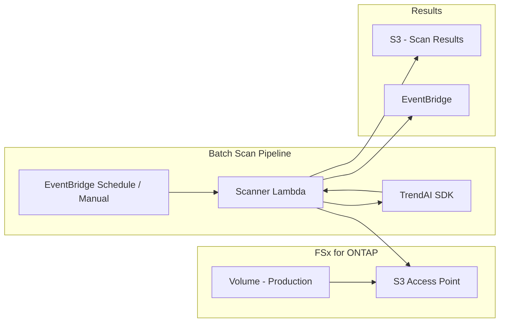

# TrendAI File Security — S3 AP Batch Scan Architecture

## 概要 / Overview

FSx for ONTAP S3 Access Points 経由で既存ファイルをバッチスキャンするパターン。
リアルタイム Vscan を補完し、シグネチャ更新後の遡及スキャンや定期監査に使用する。

## Architecture Diagram

## Use Cases

| Scenario | Trigger | Purpose |
|----------|---------|---------|
| シグネチャ更新後の再スキャン | EventBridge Schedule (daily) | 昨日まで CLEAN だったファイルが新シグネチャで INFECTED に変わるケースを検出 |
| 定期コンプライアンス監査 | Manual / Monthly schedule | 全ファイルの Clean 証明 |
| Vscan フォールバック | Vscan passthrough 発生後 | passthrough で通過したファイルの事後スキャン |
| 新ボリュームの初回スキャン | Volume migration event | 移行されたデータの検証 |

## Trade-offs vs Vscan/ICAP

| Aspect | Vscan/ICAP | S3 AP Batch |
|--------|-----------|-------------|
| Timing | リアルタイム（書き込み時） | バッチ（事後） |
| Block capability | あり（書き込みブロック） | なし（検知のみ） |
| Coverage | 新規ファイルのみ | 既存ファイル含む全量 |
| Cost | EC2 常時稼働 | Lambda 従量課金 |
| Signature freshness | スキャン時点のシグネチャ | 最新シグネチャで再検査可能 |

## Limitations

- S3 AP は読み取り専用 → 書き込みブロックは不可
- 検知結果に基づくアクションは EventBridge → Step Functions で実行
- 大量ファイルスキャンは Lambda 同時実行数・TrendAI API レート制限に注意

## References

- [FSx for ONTAP — S3 Access Points](https://docs.aws.amazon.com/fsx/latest/ONTAPGuide/s3-access-points.html)
- [FSx-for-ONTAP-S3AccessPoints-Serverless-Patterns](https://github.com/Yoshiki0705/FSx-for-ONTAP-S3AccessPoints-Serverless-Patterns) — 参考実装
