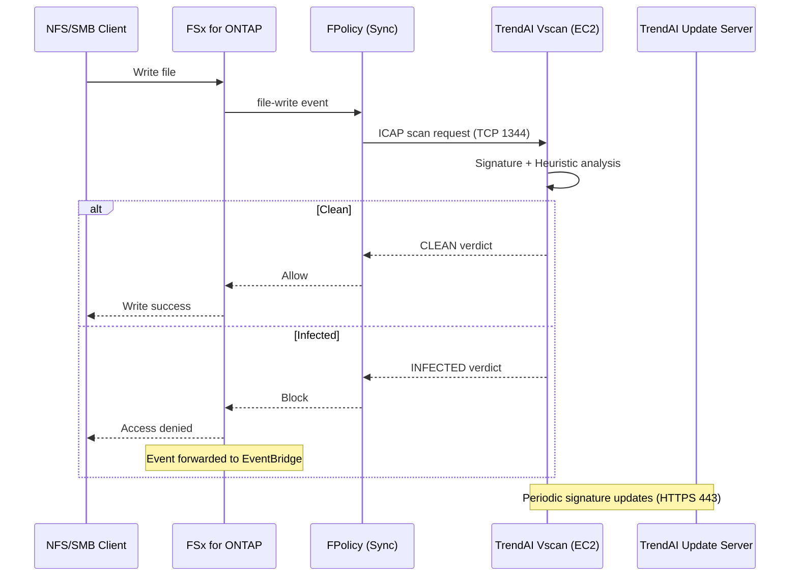

# TrendAI File Security — Vscan/ICAP Architecture

## 概要 / Overview

ONTAP Vscan 機能により、ファイル書き込み時に FPolicy (synchronous) が TrendAI Vscan サーバーへ
ICAP プロトコルでスキャン要求を送信。verdict (CLEAN/INFECTED) に基づき書き込みを許可/ブロック。

## Architecture Diagram

## EC2 Vscan Server Requirements

| Aspect | Specification |
|--------|--------------|
| Instance type | c6i.xlarge (100 ops/sec) ~ c6i.2xlarge (500 ops/sec) |
| OS | Amazon Linux 2023 or RHEL 9 |
| Subnet | Security subnet (sg-vscan) |
| Inbound | TCP 1344 from sg-fsx only |
| Outbound | TCP 443 to TrendAI update servers (via NAT) |
| IMDSv2 | Required (HttpTokens: required) |
| Storage | 50 GiB gp3 (for signature DB + logs) |

## FPolicy Configuration

Uses synchronous mode — see [FPolicy Configuration](../ontap-native/fpolicy-configuration.md) for full setup.

Key settings:
- Engine type: `synchronous`
- Port: 1344 (ICAP standard)
- `is-mandatory: false` (passthrough-on-error for availability)

## Scan Target Filtering

| Filter | Recommendation |
|--------|---------------|
| Extensions to scan | exe, dll, scr, bat, cmd, ps1, vbs, js, docm, xlsm, pptm, zip, rar, 7z |
| Extensions to skip | log, tmp, csv, txt (low risk) |
| Max file size | 100 MB (configurable, larger files may timeout) |
| Operations | `first-write` filter (scan only on create, not every update) |

## Fallback / Error Handling

| Scenario | Behavior | Recovery |
|----------|----------|---------|
| Vscan server unreachable | FPolicy passthrough (allow write) | CloudWatch alarm → investigate |
| Scan timeout (>30s) | FPolicy passthrough | Retry via S3 AP batch scan |
| Vscan server crash | Auto-recovery via ASG | Secondary server takes over |

## Performance Impact

- Typical latency increase: 5-30ms per file write (depends on file size)
- Mitigation: `first-write` filter, extension filtering, multiple Vscan servers
- Monitoring: CloudWatch custom metric for scan latency percentiles

## References

- [NetApp ONTAP — Vscan](https://docs.netapp.com/us-en/ontap/antivirus/)
- [TrendAI Vision One — File Security](https://www.trendmicro.com/en_us/business/products/network-security/file-storage-security.html)
